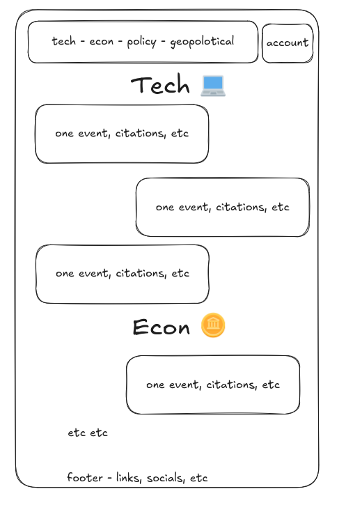

# Minimalist News Dashboard

A clean, elegant news dashboard built with React, Tailwind CSS, and shadcn UI components.

test changes

## Features

- Clean, minimalist UI design
- Category-based news navigation
- Responsive layout that works on all devices
- Custom color palette based on user preferences
- Google Font's "Lato" for a modern, readable typography

## Color Palette

The application uses a carefully selected color palette:

- E0E1DD (Light Gray)
- 778DA9 (Light Blue Gray)
- 415A77 (Medium Blue)
- 1B263B (Dark Blue)
- 0D1B2A (Darkest Blue)

## Design Reference

The design follows this minimalist sketch:



## Technologies Used

- React
- Tailwind CSS
- shadcn UI components
- Lucide React icons

## Getting Started

```bash
# Install dependencies
npm install

# Start the development server
npm run dev
```
